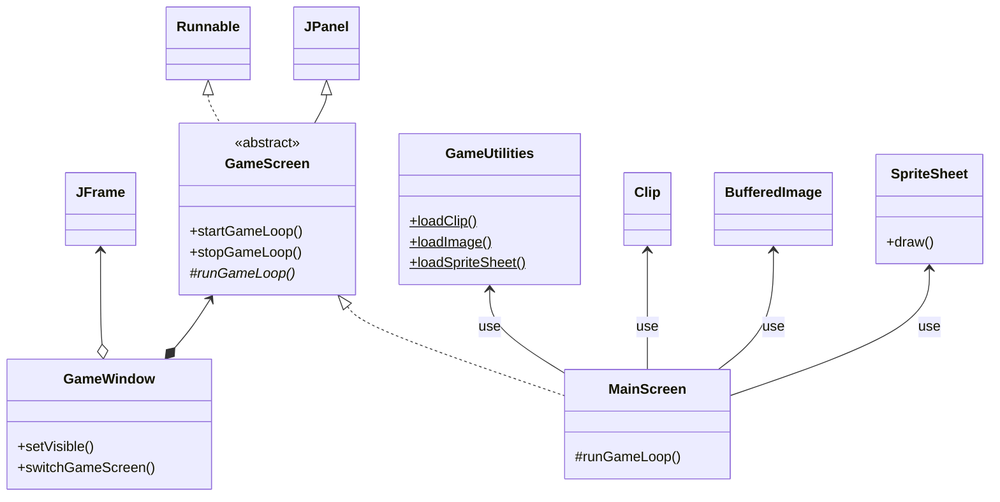

# JGLib
「JGLib」はJava言語用の2Dゲームライブラリです。

```mermaid
classDiagram
  JFrame <--o GameWindow
  JPanel <|-- GameScreen
  Runnable <|.. GameScreen
  GameScreen <|.. MainScreen
  GameScreen <--* GameWindow
  GameUtilities <-- MainScreen : use
  Clip <-- MainScreen :use
  BufferedImage <-- MainScreen : use
  SpriteSheet <-- MainScreen :use
  class GameWindow {
    +setVisible()
    +switchGameScreen()
  }
  class GameScreen {
    <<abstract>>
    +startGameLoop()
    +stopGameLoop()
    #runGameLoop()*
  }
  class MainScreen {
    #runGameLoop()
  }
  class GameUtilities {
    +loadClip()$
    +loadImage()$
    +loadSpriteSheet()$
  }
  class SpriteSheet {
    +draw()
  }
```
